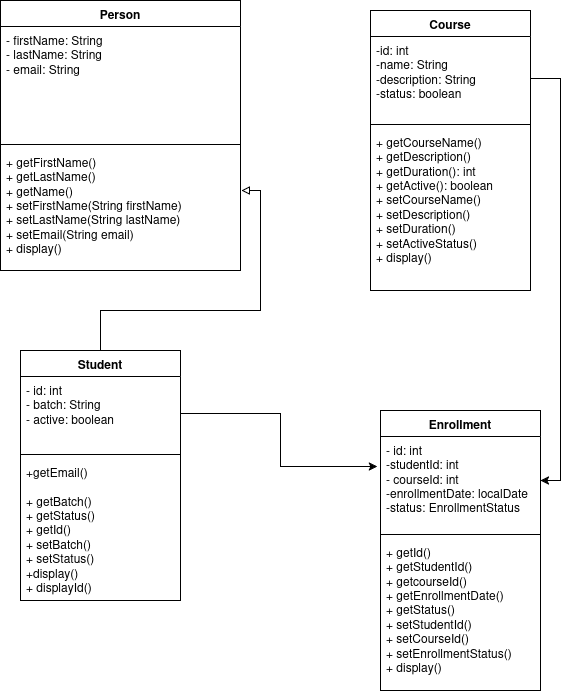

## Getting Started
This is learntrack, a one stop learning platform where you can create students and courses, enroll students to these courses, and complete the courses.

## Folder Structure

The workspace contains two folders by default, where:

- `src`: the folder to maintain sources
- `lib`: the folder to maintain dependencies

Meanwhile, the compiled output files will be generated in the `bin` folder by default.

### Packages
Main Package - `com.airtribe.learntrack`
Sub Packages -
- `docs` - This package contains the documentation for the project.
- `entity` - Contains entity classes eg - Person, Student, Course, Enrollment
- `exception` - Contains custom exception classes
- `service` - Contains all the service methods. Methods include - addStudent, listStudents, viewStudent, addCourse, listCourse, enrollStudent, viewEnrollments, etc.
- `ui` - Contains the main runnable class
- `util` - Contains utility classes like IdGenerator and enums.

## Class Diagram - 
